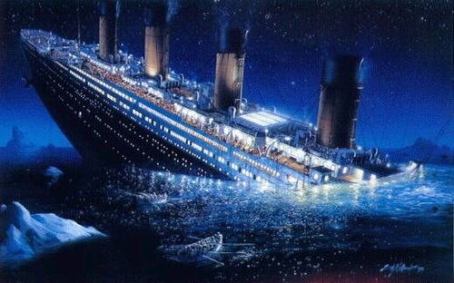

## [View the work](https://github.com/uoojin1/kaggle-titanic/blob/master/Titanic.ipynb)

## Titanic: Machine Learning from Disaster

### Competition Description

The
sinking of the RMS Titanic is one of the most infamous shipwrecks in history.
On April 15, 1912, during her maiden voyage, the Titanic sank after colliding
with an iceberg, killing 1502 out of 2224 passengers and crew. This sensational
tragedy shocked the international community and led to better safety regulations
for ships.

One of the reasons that the shipwreck led to such loss of life was
that there were not enough lifeboats for the passengers and crew. Although there
was some element of luck involved in surviving the sinking, some groups of
people were more likely to survive than others, such as women, children, and the
upper-class.

In this challenge, we ask you to complete the analysis of what
sorts of people were likely to survive. In particular, we ask you to apply the
tools of machine learning to predict which passengers survived the tragedy.

</img>

## 2. Collecting the data

training and testing data set can be obtained from
https://www.kaggle.com/c/titanic/data

```python
# importing plotting libraries
import matplotlib.pyplot as plt
%matplotlib inline
import seaborn as sns
sns.set() # set seaborn default for plots

# Load training and testing dataset with pandas
import pandas as pd

train = pd.read_csv('train.csv')
test = pd.read_csv('test.csv')
```

```python
# Let's peek on the training data
train.head()
```

### Data Dictionary

|Variable|Definition|Key|
|---|---|---|
|survival|Survival
|0 = No, 1 = Yes|
|pclass	|Ticket class	1 = 1st, 2 = 2nd, 3 = 3rd|
|sex	|Sex	||
|Age	|Age in years	||
|sibsp	|# of siblings / spouses aboard the Titanic	||
|parch	|# of parents / children aboard the Titanic	||
|ticket	|Ticket number	||
|fare	|Passenger fare	||
|cabin	|Cabin number	||
|embarked|Port of Embarkation|C
= Cherbourg, Q = Queenstown, S = Southampton|

### Variable Notes
**pclass**: A
proxy for socio-economic status (SES)
1st = Upper
2nd = Middle
3rd = Lower
**age**: Age is fractional if less than 1. If the age is estimated, is it in the
form of xx.5

**sibsp**: The dataset defines family relations in this way...
Sibling = brother, sister, stepbrother, stepsister
Spouse = husband, wife
(mistresses and fiancés were ignored)

**parch**: The dataset defines family
relations in this way...
Parent = mother, father
Child = daughter, son,
stepdaughter, stepson
Some children travelled only with a nanny, therefore
parch=0 for them|.
